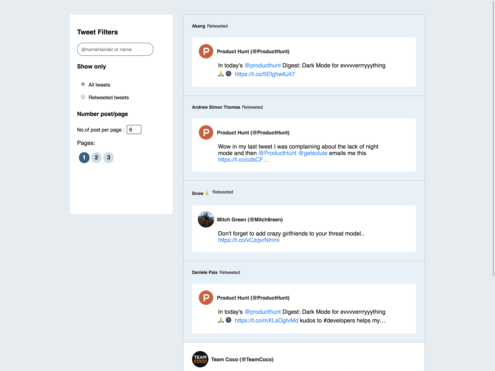

# ChangeLog :

 a) Basic setup for angular 8 project is ready for twitter-feeds

# FEInterview
Best of luck for success. 
Please go through the storyboard for more detail on code test

# StoryBoard
    The objective of this application is creating UI for twitter feed from 
    JSON which is part of this Repo, Please create your own copy of 
    this repo by 'Forking' it.
 
 ## Requirement
    
    Creating UI from 'tweeter feed JSON', Similar to below attached screenshot
    

### Tweeter feed functionality expectation:
    * Search box to find specific user's tweet 
    * Filter for Retweeted tweets 
    * Post per page / Relavent pagination
    * All' @handels' should be clickable with live links
    * Retweets and tweets should be visually differentiable 
    * Twitter users profile pic should be shown as part of the tweet
    * Should be responsive for all screens from Mobile Tab Desktop screen
    
### Delivery expectation:
    * Should be deployable package, Deployed at any [Heroku server ](http://www.heroku.com) is added advantage
    * Unit test is expected with 70% minimum coverage, Report should be pushed as part of the branch
    * Pull Request from Froked branch to master branch should be created as part of delivery
    
    
 ## License
    
    This project is licensed under CGI B&I 

      
  
   
